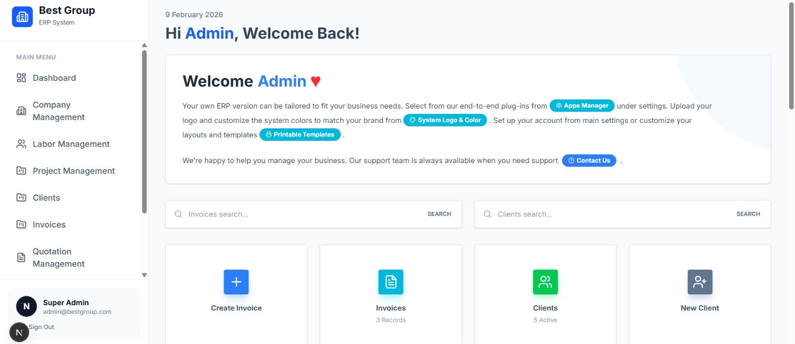
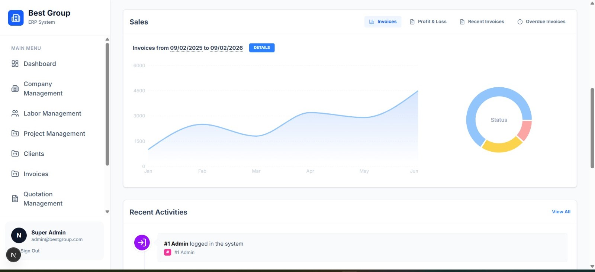
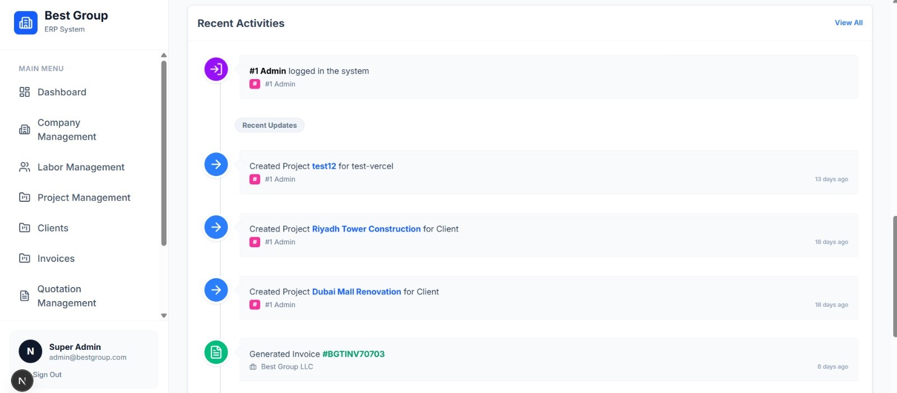
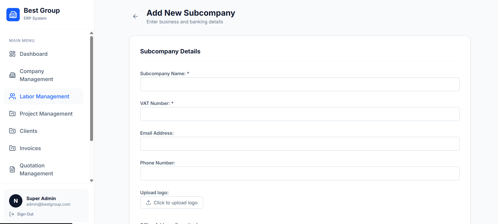
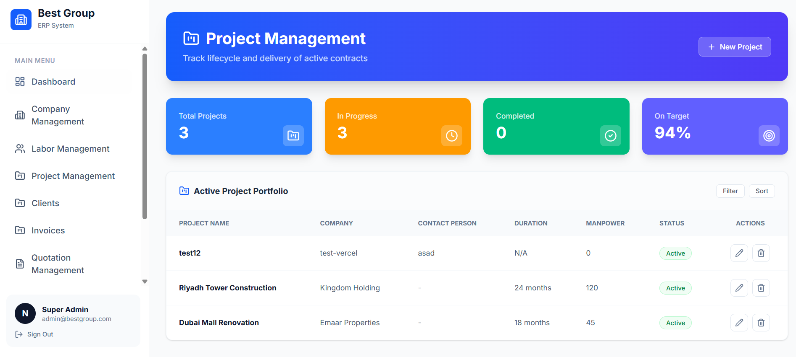
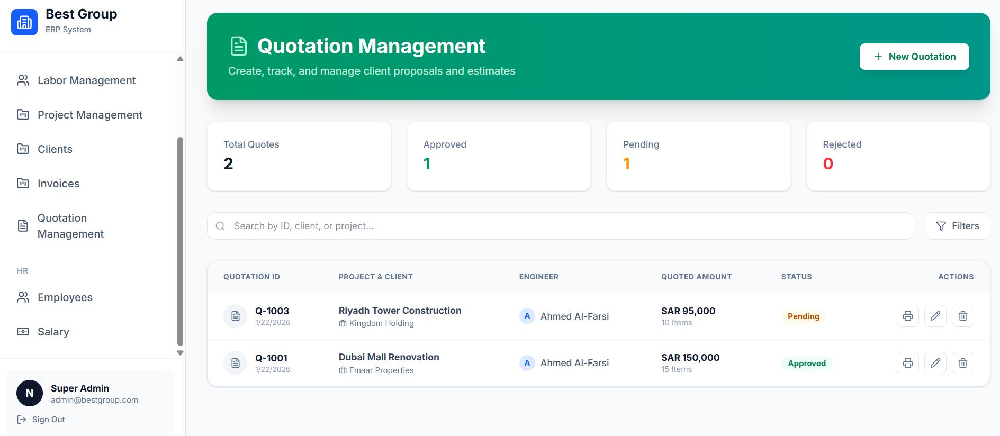
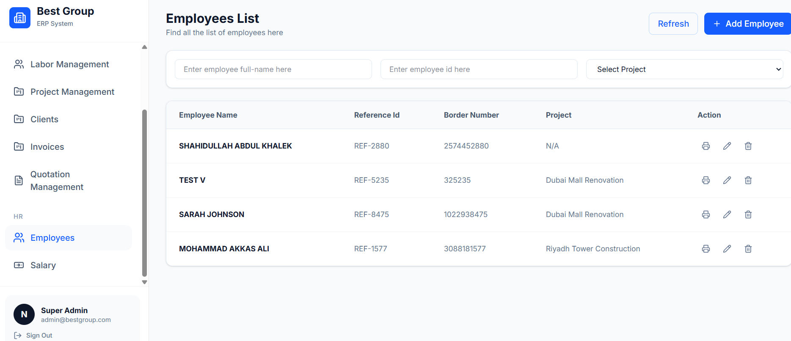

# Best Group ERP

**Live:** [https://best-group-erp.vercel.app/](https://best-group-erp.vercel.app/)

**Best Group ERP** is a cloud-first, modular Enterprise Resource Planning platform built to streamline business operations while ensuring regional compliance. It unifies Sales, HR, Projects, Finance, and Client management into a single, action-oriented dashboard — with special tooling for safe, client-side import of government-standard Mudad Excel files.

---

## Table of Contents

* Screenshots
* Live Demo
* Key Features
* Tech Stack
* Project Structure
* Environment & Setup
* Database (Prisma + Supabase)
* Development
* Deployment (Vercel)
* Security & Compliance Notes
* Roadmap
* Contributing
* Contact & License

---

## Screenshots


### Interactive Dashboard



### Sales Analytics & Activity Timeline







## Add a new Subcompany









---

## Live Demo

Open the live site:

[https://best-group-erp.vercel.app/](https://best-group-erp.vercel.app/)

---

## Key Features

### Modular Architecture

* Company & Clients (Master/Sub-company logic)
* Invoices & Quotations
* Projects & Engineer assignments
* HR & Labor compliance
* Expenses, Commissions & Purchase Orders

### Mudad Excel Import

* Browser-side `.xlsx` parsing
* Editable preview before syncing
* Secure data mapping to database

### Regional Compliance

* VAT Number tracking
* CR Number tracking
* Iqama & Passport management
* Government-standard format compatibility

### Smart Dashboard

* KPI cards
* Activity timeline
* Revenue visualization using charts
* Quick-action tiles

---

## Tech Stack

* Next.js (App Router, Server Actions)
* Prisma ORM
* PostgreSQL (Supabase)
* Tailwind CSS
* SheetJS (xlsx parsing)
* Recharts
* Lucide Icons
* Vercel (Deployment)

---

## Project Structure

```
app/
 ├── (dashboard)/
 ├── actions/
components/
prisma/
lib/
public/
```

---

## Environment & Setup

Clone repository:

```
git clone <your-repo-url>
cd your-repo
```

Install dependencies:

```
npm install
```

Create `.env` file:

```
DATABASE_URL="postgresql://[USER]:[PASSWORD]@[HOST]:6543/postgres?pgbouncer=true"
DIRECT_URL="postgresql://[USER]:[PASSWORD]@[HOST]:5432/postgres"
```

---

## Database (Prisma + Supabase)

Push schema and generate Prisma Client:

```
npx prisma db push
npx prisma generate
```

---

## Development

Start development server:

```
npm run dev
```

Open:

[http://localhost:3000](http://localhost:3000)

---

## Deployment (Vercel)

1. Push code to GitHub
2. Import project into Vercel
3. Add `DATABASE_URL` to Environment Variables
4. Deploy

Live URL:
[https://best-group-erp.vercel.app/](https://best-group-erp.vercel.app/)

---

## Security & Compliance Notes

* Client-side Excel parsing reduces server upload risks
* Sensitive data handled via secure Server Actions
* Use environment variables for secrets

---

## Roadmap

* Role-based access control
* Advanced financial reporting
* Audit logging
* Multi-language support
* Cloud storage integration

---

## Contributing

1. Fork repository
2. Create feature branch
3. Commit changes
4. Open Pull Request

---

## Contact & License

Best Group ERP

Proprietary business software. Contact the owner for usage permissions.
